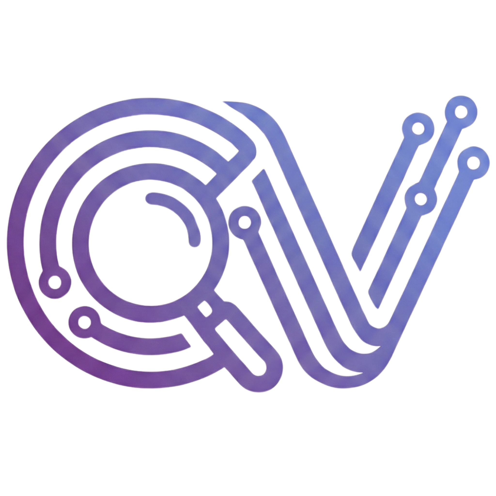
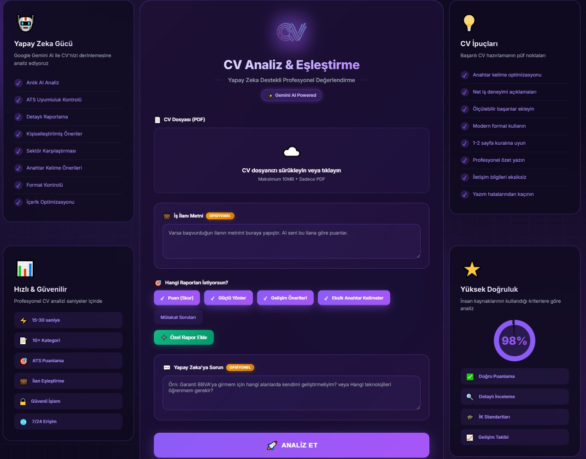

<div align="center">
<div align="center">
  <a href="https://cvanaliz.com.tr" target="_blank">
    
  </a>
</div>
  <!-- Logo and Title Block -->
  
  
  <h1 style="font-size: 2.5rem; margin-top: 10px;">CV Analysis & Matching</h1>
  
  <h3 style="color: #667eea; margin-top: -15px;">AI-Powered Career Architect</h3>

  <p>
    <a href="#proje-hakkında">About</a> •
    <a href="#teknolojiler">Technologies</a> •
    <a href="#kurulum">Installation</a> •
    <a href="#yapi">Structure</a>
  </p>

  <a href="https://cvanaliz.com.tr" target="_blank">
    
  </a>
</div>
</div>

<br/>

## 🎯 Project Goal & Personal Motivation

This project was developed to enhance my skills in **Python and Artificial Intelligence (LLM)** technologies by applying them to a real-world problem.

I aimed to gain practical experience in **Backend architecture (Flask)** and **Prompt Engineering**, moving beyond just theoretical knowledge.

### 💡 Key Takeaways & Learned Skills:
* **AI Integration:** Integrating an LLM model into a live web application using Google Gemini API.
* **Prompt Engineering:** Ensuring consistent and structured outputs by casting the AI in the role of a 'Recruiter'.
* **Web Architecture:** Building a lightweight and modular backend structure with Flask.
* **Modern UI:** Developing a modern (Glassmorphism) interface using pure CSS instead of ready-made libraries.
* **Security:** Management of API keys (.env) and server-side file validations.

<br/>

## 💎 Architecture & 4 Core Pillars

This project is not just a simple interface. It is built with professional software engineering principles and a **"Glassmorphism"** design language. Here are the 4 main pillars supporting the system:

<table>
  <tr>
    <td width="50%" valign="top" style="border: 1px solid rgba(0,0,0,0.1); border-radius: 10px; padding: 15px;">
      <h3 align="center">🔒<br/>Security & Isolation</h3>
      <p align="center">
        Sensitive API keys (Google Gemini) are completely abstracted from the code. Full security is ensured via <code>.env</code> file structure. Even if the code is shared, your keys remain private.
      </p>
    </td>
    <td width="50%" valign="top" style="border: 1px solid rgba(0,0,0,0.1); border-radius: 10px; padding: 15px;">
       <h3 align="center">🔮<br/>Premium UI (Glassmorphism)</h3>
      <p align="center">
        Far from standard templates, designed with a custom <strong>Vanilla CSS</strong> approach. A modern user experience with "frosted glass" effects on a purple gradient background.
      </p>
    </td>
  </tr>
  <tr>
    <td width="50%" valign="top" style="border: 1px solid rgba(0,0,0,0.1); border-radius: 10px; padding: 15px;">
       <h3 align="center">🧠<br/>Advanced AI Logic</h3>
      <p align="center">
        More than just a chatbot. Using <strong>System Instructions</strong> tailored for the model (Gemini 1.5) and a strict scoring rubric, it analyzes like a professional HR expert.
      </p>
    </td>
    <td width="50%" valign="top" style="border: 1px solid rgba(0,0,0,0.1); border-radius: 10px; padding: 15px;">
       <h3 align="center">⚡<br/>Feature-Focused Backend</h3>
      <p align="center">
        The power of Python and Flask. A high-performance structure stripped of unnecessary libraries, focusing solely on file processing and AI orchestration.
      </p>
    </td>
  </tr>
</table>

<br/>

## 📂 Project Structure

A clean and modular file organization:

```bash
CV-ANALYSIS-APP/
├── 📄 app.py              # Main Application Entry Point (Flask)
├── 📄 .env                # Environment Variables (API Keys - Hidden)
├── 📄 requirements.txt    # Project Dependencies
├── 📄 Dockerfile          # Container Configuration
├── 📁 static/
│   ├── 🖼️ favicon.png     # Logo Assets
│   └── 🖼️ screenshot.png  # Interface Preview
└── 📁 templates/
    └── 🎨 index.html      # Frontend Interface (HTML + CSS)
```

<br/>

## 🛠️ Technology Stack

Our project combines the most powerful tools of modern web technologies.

<div align="center">
  <table>
    <tr>
      <td align="center" width="130">
        
        <br/><b>Python 3.9+</b>
      </td>
      <td align="center" width="130">
        
        <br/><b>Flask</b>
      </td>
      <td align="center" width="130">
        
        <br/><b>Gemini AI</b>
      </td>
      <td align="center" width="130">
        
        <br/><b>Vanilla CSS</b>
      </td>
    </tr>
     <tr>
      <td align="center" width="130">
        <br/><b>Markdown Lib</b><br/>
        <small>Text Rendering</small>
      </td>
      <td align="center" width="130">
        <br/><b>Glassmorphism</b><br/>
        <small>Custom CSS Design</small>
      </td>
      <td align="center" width="130">
        <br/><b>Dotenv</b><br/>
        <small>Security</small>
      </td>
      <td align="center" width="130">
        <br/><b>Jinja2</b><br/>
        <small>Template Engine</small>
      </td>
    </tr>
  </table>
</div>

<br/>

## 🚀 Installation & Setup

Get it running on your local machine in just 4 steps.

1.  **Clone the Repo**
    ```bash
    git clone https://github.com/yourusername/cv-analysis-project.git
    cd cv-analysis-project
    ```

2.  **Prepare Virtual Environment**
    ```bash
    # Windows
    python -m venv venv
    venv\Scripts\activate
    ```

3.  **Install Requirements**
    ```bash
    pip install -r requirements.txt
    ```

4.  **Add Security Key**
    Create a `.env` file in the folder and add your key:
    ```env
    GENAI_API_KEY=YourKeyHere
    ```
    *(You can get your key for free from Google AI Studio)*

5.  **Start App!** 🏁
    ```bash
    python app.py
    ```

<br/>

<div align="center">
  <hr style="width: 50%; border: 0; border-top: 2px solid #667eea; margin: 30px 0;" />
  <p>This project is a personal initiative built to master Full-Stack development and AI integration skills.</p>
</div>


